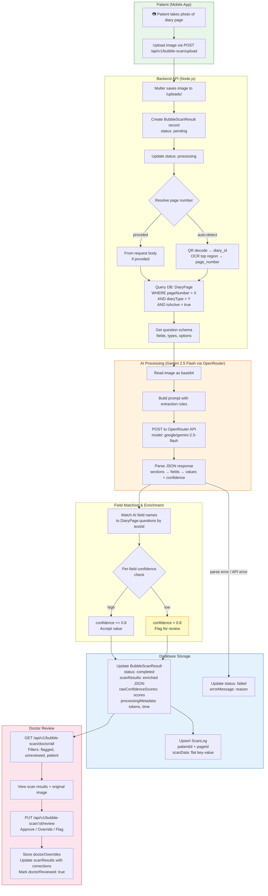
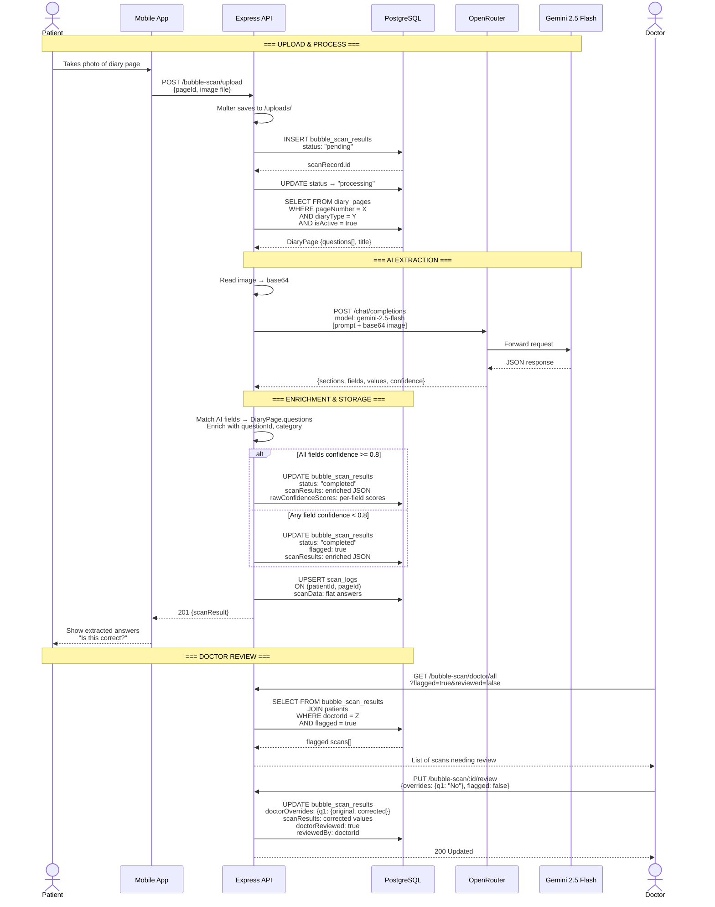
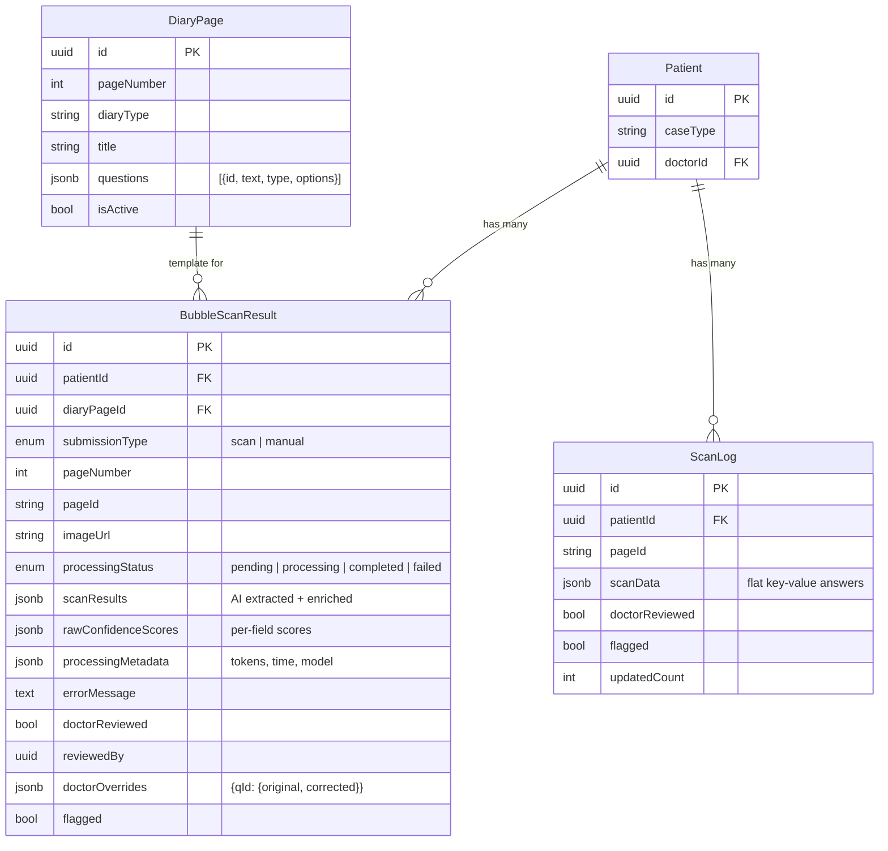

# Diary Page Scan — Full Lifecycle

## High-Level Flow



## Detailed Data Flow



## Database Schema Relationships



## scanResults JSONB Structure (after enrichment)

```json
{
  "q1": {
    "answer": "Yes",
    "confidence": 0.95,
    "questionText": "Mammogram",
    "category": "investigation"
  },
  "q2": {
    "answer": "No",
    "confidence": 0.88,
    "questionText": "USG Breast(s)",
    "category": "investigation"
  }
}
```

## Processing Cost Estimate

| Volume | Cost (Gemini 2.5 Flash) |
|--------|------------------------|
| 1 image | ~$0.0007 |
| 1,000 images | ~$0.70 |
| 40,000 images | ~$28 |
| Monthly (2,000 pages) | ~$1.40/month |
